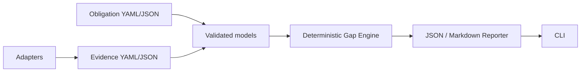

# Architecture

The core has no framework knowledge. Adapters normalize producer output; only
the core evaluates explicit protocol data. The Quality Planner
(`qcov.engine.planner`) ranks unproven gaps into a draft proposal and never
feeds Gap Engine or policy decisions. Agent helpers (`qcov.engine.explain`,
`qcov.engine.agent_next`) explain gaps/plan items and select next steps under
`contractVersion: qcov.agent/v1`; they also never satisfy gaps or change policy.
See [agent playbook](agent.md).

`qcov.yaml` resolves report paths relative to itself. JUnit/coverage readers
parse local files only and feed scan diagnostics, never the Gap Engine directly.
