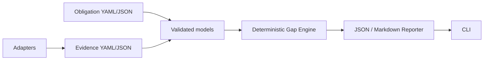

# Architecture

```mermaid
flowchart LR
  O[Obligation YAML/JSON] --> L[Validated models]
  E[Evidence YAML/JSON] --> L
  A[Adapters] --> E
  L --> G[Deterministic Gap Engine]
  G --> R[JSON / Markdown Reporter]
  R --> C[CLI]
```

The core has no framework knowledge. Adapters normalize producer output; only
the core evaluates explicit protocol data.
