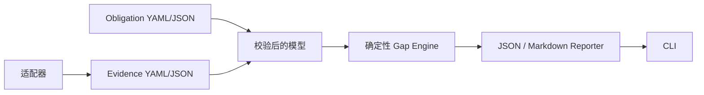

# 架构

```mermaid
flowchart LR
  O[Obligation YAML/JSON] --> L[校验后的模型]
  E[Evidence YAML/JSON] --> L
  A[适配器] --> E
  L --> G[确定性 Gap Engine]
  G --> R[JSON / Markdown Reporter]
  R --> C[CLI]
```

Core 不理解具体框架；Adapter 只标准化生产者输出，只有 Core 评估协议数据。
