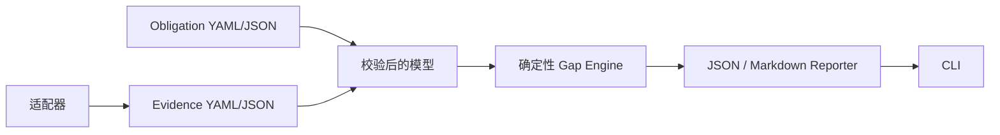

# 架构

Core 不理解具体框架；Adapter 只标准化生产者输出，只有 Core 评估协议数据。Quality Planner（`qcov.engine.planner`）仅将未满足缺口排序为 draft 提案，从不进入 Gap Engine 或 policy 判定。

`qcov.yaml` 相对自身解析报告路径。JUnit/coverage reader 仅解析本地文件并输出 scan diagnostics，不会直接进入 Gap Engine。
